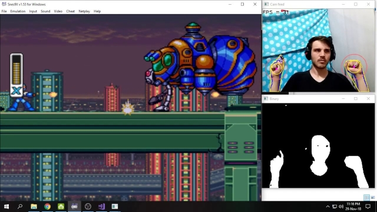

# Manus

Send keyboard inputs to your Windows system using only hand gestures in real time, you can even play games. Click the image bellow to see the video demonstration:

This was my final assignment for my computer vision class, we were free to implement anything, i choose the coolest thing that i could think of.

The gesture detection is done by a custom algorithm that i made, it does not use any Machine Learning since i didn't have knowledge of that at the time. 

:warning: *This documentation is incomplete, in the future i want to make a full tutorial explaining the algorithm and how to compile and execute the program. I Also want to go back to this someday and implement a GUI, maybe machine learning, and make the program more customizable.*